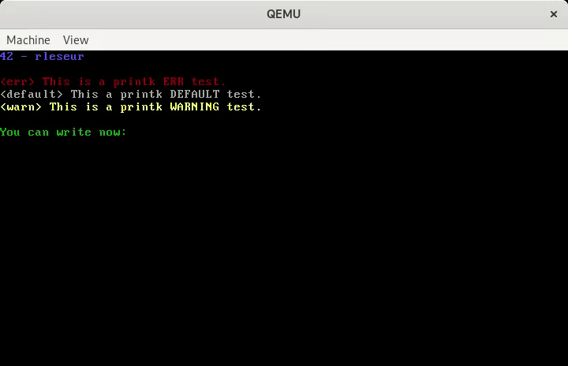

# KFS-1

Discover the world of "Kernel Programming" and learn how to create your very own Kernel from scratch.

This project is the first in a serie of 10 projects, introducing into the Kernel world. This first project is a very basic kernel with some features.

Is based on a i386 (x86) architecture.



**Options**:
- Color support
- Keyboard handler
- Helper 'printk'
- Scroll and cursor support
- Different screens helper and keyboard shortcut
- Create Iso image from kernel binary

**Shortcuts**:
- **F1**: go to previous screen
- **F2**: go to next screen

*NB: you can use the dependencies.txt to install all necessaries packages. ``sudo apt/dnf install $(cat dependencies.txt)``*

## KERNEL

### Compilation

#### Simple way

```
make
```

#### Hard way

```
$ nasm -f elf32 boot.asm -o boot.o
$ gcc -m32 -c kernel.c -o kernel.o
$ ld -m elf_i386 -T link.ld -o [your kernel name] boot.o kernel.o
```

<i>It is recommended to name your kernel with the formal</i>: ``kernel-<version>``. <i>I named mine "kernel-kfs.1.rleseur".</i>

### Run on QEMU

#### Simple way

```
make run-kernel
```

#### Hard way

```
qemu-system-i386 -kernel [your compiled kernel]
```

### Installation

- Take the last Debian ISO and make a VM in virtualbox.

- Clone the repo in it.

- Copy the compiled kernel in ``/boot`` directory.

- Modify the ``/boot/grub/grub.cfg`` and add an entry:

```
menuentry 'My Kernel' {
	set root='hd0,msdos1'
	multiboot /boot/[your compiled kernel] ro
}
```

- Reboot and select ``My Kernel`` entry.

## ISO

### Compilation

#### Simple way

```
make iso
```

#### Hard way

```
$ mkdir -p /iso/boot/grub
$ cp [your compiled kernel] /iso/boot
$ cp grub.cfg /iso/boot/grub
$ grub-mkrescue -o [your iso name] iso
```

### Run on QEMU

#### Simple way

```
make run-iso
```

#### Hard way

```
qemu-system-i386 -cdrom [your iso]
```

## Resources

- The BIBLE, for basic kernel: https://arjunsreedharan.org/post/82710718100/kernels-101-lets-write-a-kernel

- The BIBLE 2, for keyboard: https://arjunsreedharan.org/post/99370248137/kernels-201-lets-write-a-kernel-with-keyboard

- For keyboard scancodes: https://aeb.win.tue.nl/linux/kbd/scancodes-1.html

- For another system of keyboard, color and build iso image: https://theogill.medium.com/creating-a-kernel-from-scratch-1a1aa569780f

- To move the cursor: https://hasinisama.medium.com/building-your-own-operating-system-drivers-8adfc889398b
